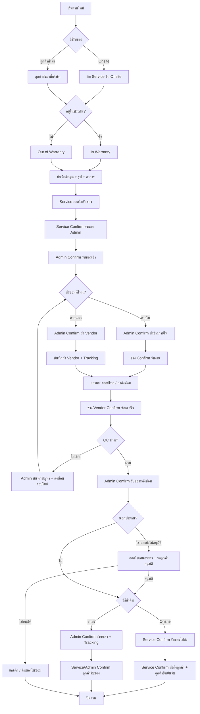
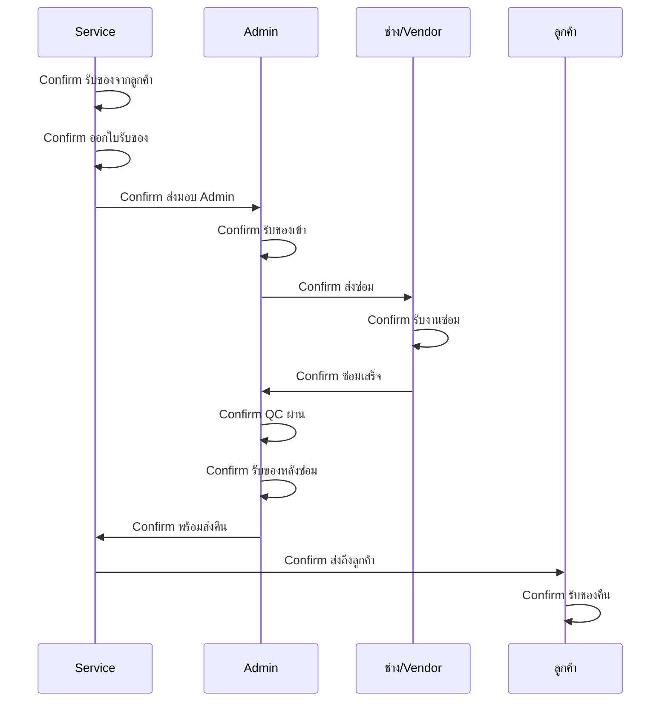
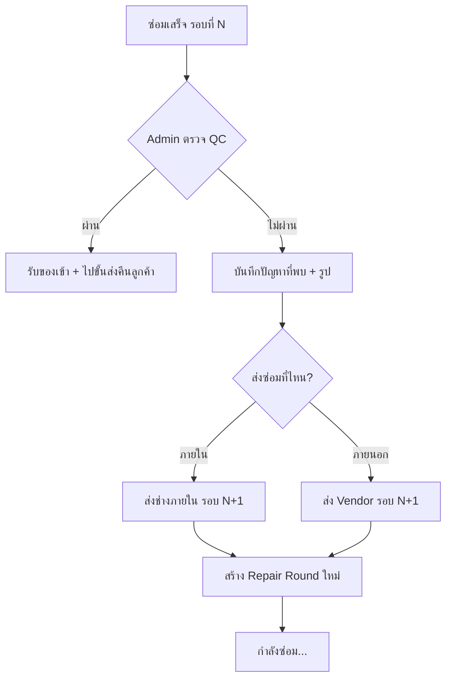
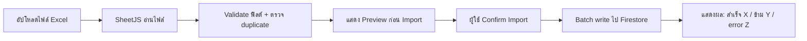
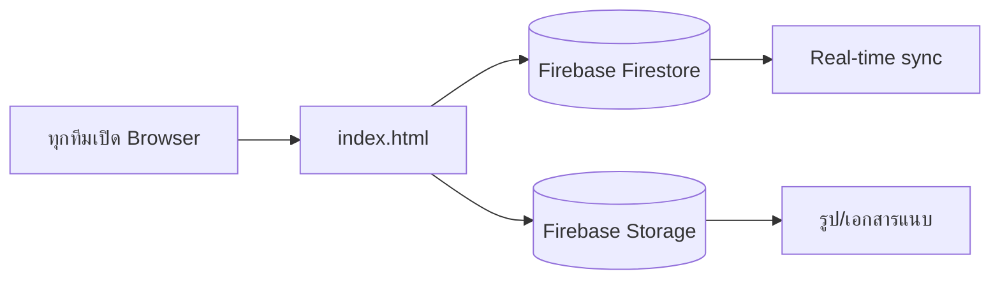

# ระบบบันทึกการรับส่งของ ซ่อม เปลี่ยน (HTML + Firebase)

## สรุปการตรวจสอบ Process เดิม

Process ที่คุณออกแบบไว้ **ครอบคลุม flow หลักได้ดี** (รับของ → ใบรับ → ส่ง Admin → ซ่อม → รับคืน → ส่งลูกค้า) แต่ยัง **ขาดจุดสำคัญ** ที่ทำให้ใช้งานจริงในองค์กรไม่ครบ:

| ช่องว่าง | ทำไมต้องมี |
|---|---|
| ข้อมูลลูกค้า/สินค้า (รุ่น, S/N, อาการ) | อ้างอิงงานและค้นหาย้อนหลัง |
| ตรวจสอบประกัน + แนบหลักฐาน | แยก in/out warranty ต้องมีหลักฐาน |
| ตรวจสอบสภาพตอนรับ (รูป/ความเสียหาย) | ป้องกันข้อพิพาทตอนคืน |
| ใบเสนอราคา + รอลูกค้าอนุมัติ (นอกประกัน) | ซ่อมนอกประกันต้องได้รับอนุมัติก่อน |
| สถานะย่อยระหว่างซ่อม (รออะไหล่, กำลังซ่อม) | ติดตามงานค้างได้จริง |
| QC หลังซ่อม | กันของเสียออกไปถึงลูกค้า |
| เลข Tracking ขนส่ง / หลักฐานส่งคืน | ติดตามของระหว่างทาง |
| กรณีซ่อมไม่ได้ / ยกเลิก / เปลี่ยนเครื่อง | flow จริงมี exception เสมอ |
| ฐานข้อมูลบริษัทซ่อมภายนอก (Vendor) | ติดตามของถูกที่ + วัดระยะเวลาซ่อม |
| ส่งซ่อมซ้ำเมื่อ QC ไม่ผ่าน | ของกลับมาแล้วยังเสีย ต้องส่งซ่อมรอบใหม่ |
| ประวัติการซ่อมต่อ S/N | รู้ว่าซ่อมไปกี่ครั้ง วิเคราะห์สินค้าซ้ำซ้อน |
| Dashboard + ค้นหา + รายงาน | ใช้ร่วมกันหลายทีมต้องหางานได้เร็ว |

---

## Flow ที่ออกแบบเพิ่มเติม (ครบถ้วน)



### สถานะงาน (Status) ที่ใช้ในระบบ

| Status | ความหมาย | ทีมที่ action ได้ |
|---|---|---|
| `new` | สร้างงานใหม่ | Service |
| `received` | รับของจากลูกค้าแล้ว | Service |
| `receipt_issued` | ออกใบรับของแล้ว | Service |
| `handed_to_admin` | ส่งมอบ Admin แล้ว | Service |
| `admin_received` | Admin รับเข้าแล้ว | Admin |
| `quote_pending` | รอใบเสนอราคา/อนุมัติ (นอกประกัน) | Admin |
| `sent_internal_repair` | ส่งซ่อมภายใน | Admin |
| `sent_external_repair` | ส่งซ่อมภายนอก | Admin |
| `repair_in_progress` | กำลังซ่อม | Admin/ช่าง |
| `waiting_parts` | รออะไหล่ | Admin/ช่าง |
| `repair_completed` | ซ่อมเสร็จ | Admin/ช่าง |
| `qc_failed` | QC ไม่ผ่าน — รอส่งซ่อมรอบใหม่ | Admin |
| `reroute_repair` | ส่งซ่อมซ้ำ (รอบที่ 2+) | Admin |
| `admin_received_after_repair` | รับของเข้าหลังซ่อม | Admin |
| `ready_to_return` | พร้อมส่งคืนลูกค้า | Admin |
| `return_onsite` | กำลังส่ง Onsite | Service |
| `return_shipping` | ส่งขนส่งแล้ว | Admin |
| `delivered` | ลูกค้ารับของแล้ว | Service/Admin |
| `cancelled` | ยกเลิก | Admin |
| `cannot_repair` | ซ่อมไม่ได้ | Admin |

---

## ระบบ Confirm ทุกขั้นตอน (Dual-Confirm Handoff)

ทุกจุดส่งมอบใช้หลัก **"ผู้ส่ง Confirm → ผู้รับ Confirm"** ก่อนเปลี่ยนสถานะถัดไป ป้องกันของหายระหว่างทางและตรวจสอบเวลาได้



### ตาราง Confirm ครบทุกขั้นตอน

| ลำดับ | ขั้นตอน | ผู้ Confirm ฝั่งส่ง | ผู้ Confirm ฝั่งรับ | สถานะหลัง Confirm ครบ |
|---|---|---|---|---|
| 1 | รับของจากลูกค้า | Service | — (ลูกค้าลงนามในใบรับ) | `received` |
| 2 | ออกใบรับของ | Service | — | `receipt_issued` |
| 3 | ส่งมอบ Admin | Service | Admin | `admin_received` |
| 4a | ส่งซ่อมภายใน | Admin | ช่างซ่อม | `sent_internal_repair` |
| 4b | ส่งซ่อมภายนอก | Admin | — (บันทึก Vendor + Tracking) | `sent_external_repair` |
| 5 | ช่าง/Vendor รับงาน | — | ช่าง/Vendor | `repair_in_progress` |
| 6 | ซ่อมเสร็จ | ช่าง/Vendor | Admin | `repair_completed` |
| 7 | QC ตรวจสอบ | Admin (QC) | — | `admin_received_after_repair` หรือ `qc_failed` |
| 7b | ส่งซ่อมซ้ำ (QC ไม่ผ่าน) | Admin | ช่าง/Vendor | `reroute_repair` → กลับขั้น 4 |
| 8 | พร้อมส่งคืน | Admin | — | `ready_to_return` |
| 9a | ส่งคืน Onsite | Service (รับของ) | Service (ส่งถึง) + ลูกค้า | `delivered` |
| 9b | ส่งคืนขนส่ง | Admin (ส่งขนส่ง) | Service/Admin (ลูกค้ารับ) | `delivered` |
| 10 | ปิดงาน | Admin | — | `closed` |

### โครงสร้างข้อมูล Confirm ใน Firestore

```
jobs/{jobId}/confirmations/{stepId}
  - stepKey: "handover_to_admin" | "admin_receive" | ...
  - stepLabel: "ส่งมอบ Admin"
  - senderTeam: "Service"
  - receiverTeam: "Admin"
  - senderConfirmed: true/false
  - senderConfirmedBy: "ชื่อพนักงาน"
  - senderConfirmedAt: timestamp
  - senderNote: "..."
  - receiverConfirmed: true/false
  - receiverConfirmedBy: "ชื่อพนักงาน"
  - receiverConfirmedAt: timestamp
  - receiverNote: "..."
  - isComplete: true/false  (ทั้งสองฝั่ง confirm แล้ว)
```

### UI การ Confirm

- แต่ละขั้นตอนแสดง **การ์ด Confirm** บนหน้า Job Detail พร้อมสถานะ:
  - รอ Confirm ฝั่งส่ง (สีเหลือง)
  - รอ Confirm ฝั่งรับ (สีส้ม)
  - Confirm ครบแล้ว (สีเขียว + แสดงเวลา/ผู้ทำ)
- ปุ่ม Confirm ต้องเลือก **ชื่อผู้ทำ** จาก dropdown + กรอก note (optional)
- Dashboard มี widget **"งานรอ Confirm"** แยกตามทีม (Service รอ X งาน, Admin รอ Y งาน)
- ไม่สามารถข้ามขั้น Confirm ได้ — state machine ล็อคจนกว่าจะ confirm ครบ

---

## มุมมอง Service — ติดตามสถานะงานที่ส่งซ่อม

**ตอบคำถาม: Service ตรวจสอบได้ว่าของอยู่ขั้นตอนไหนแล้ว** — เป็นฟีเจอร์หลักที่ออกแบบไว้ให้ Service ใช้งานได้ทันที โดยไม่ต้องโทรถาม Admin

### วิธีที่ Service ตรวจสอบได้ (3 ช่องทาง)

| ช่องทาง | รายละเอียด |
|---|---|
| **Tab "งานของ Service"** บน Dashboard | แสดงเฉพาะงานที่ Service เป็นผู้รับ/สร้าง พร้อมสถานะปัจจุบันเป็นภาษาไทย |
| **ค้นหา Tag / ชื่อลูกค้า / S/N** | พิมพ์เลข Job หรือสแกน QR จากใบรับ → เข้าหน้ารายละเอียดทันที |
| **หน้า Job Detail** | Progress bar + Timeline แสดงทุกขั้นตอนที่ผ่านมา พร้อมเวลา |

### สถานะที่ Service เห็น (ภาษาไทยเข้าใจง่าย)

แทนที่จะแสดง code เช่น `sent_internal_repair` ระบบจะแปลเป็นข้อความที่ Service อ่านแล้วรู้ทันที:

| Status Code | ข้อความที่ Service เห็น | ความหมาย |
|---|---|---|
| `received` | รับของจากลูกค้าแล้ว | รอออกใบรับ |
| `receipt_issued` | ออกใบรับแล้ว | รอส่งมอบ Admin |
| `handed_to_admin` | ส่งมอบ Admin แล้ว (รอ Admin รับ) | รอ Admin confirm |
| `admin_received` | Admin รับของแล้ว | รอส่งซ่อม |
| `sent_internal_repair` | ส่งซ่อมภายในแล้ว | อยู่ที่ช่างซ่อม |
| `sent_external_repair` | ส่งซ่อมภายนอกแล้ว | อยู่ที่ Vendor |
| `repair_in_progress` | กำลังซ่อม | ช่างกำลังดำเนินการ |
| `waiting_parts` | รออะไหล่ | งานค้างรออะไหล่ |
| `repair_completed` | ซ่อมเสร็จแล้ว (รอบที่ N) | รอ QC |
| `qc_failed` | QC ไม่ผ่าน — รอส่งซ่อมรอบใหม่ | รอ Admin ส่งซ่อมซ้ำ |
| `reroute_repair` | ส่งซ่อมซ้ำ (รอบที่ 2+) | อยู่ที่ช่าง/Vendor อีกครั้ง |
| `admin_received_after_repair` | Admin รับของหลังซ่อมแล้ว | รอส่งคืนลูกค้า |
| `ready_to_return` | พร้อมส่งคืนลูกค้า | Service สามารถนัดส่งคืนได้ |
| `return_onsite` | กำลังส่งคืน Onsite | Service กำลังไปส่ง |
| `return_shipping` | ส่งขนส่งแล้ว | รอลูกค้ารับ |
| `delivered` | ลูกค้ารับของแล้ว | ปิดงาน |
| `cancelled` | ยกเลิก | จบงาน |

### UI หน้า "งานของ Service"

```
┌─────────────────────────────────────────────────────────────┐
│  [เลือกทีม: Service ▼]  [ค้นหา Tag/ลูกค้า/S/N...]           │
├─────────────────────────────────────────────────────────────┤
│  สรุป: งานทั้งหมด 12 | กำลังซ่อม 5 | รอส่งคืน 2 | เสร็จแล้ว 5│
├─────────────────────────────────────────────────────────────┤
│  Tag          ลูกค้า      สินค้า        สถานะปัจจุบัน    อัปเดต│
│  JOB-001     คุณสมชาย    Router X1    กำลังซ่อม       2 ชม. │
│              ████████░░░░░░░░  ขั้นที่ 6/10                  │
│  JOB-002     บ. ABC       Switch Y2   รอ Admin รับ    1 วัน  │
│              ████░░░░░░░░░░░░  ขั้นที่ 3/10                  │
│  JOB-003     คุณมานี     AP Z3       พร้อมส่งคืน     3 วัน  │
│              ██████████████░░  ขั้นที่ 9/10                  │
└─────────────────────────────────────────────────────────────┘
```

- **Progress bar ย่อ** ในแต่ละแถว — Service เห็นภาพรวมทันทีว่าถึงขั้นไหนแล้ว
- **Real-time update** — เมื่อ Admin/ช่าง confirm ขั้นถัดไป สถานะเปลี่ยนทันทีโดยไม่ต้อง refresh
- **Filter เร็ว**: กำลังซ่อม / รอส่งคืน / เสร็จแล้ว / ทั้งหมด
- **Sort**: อัปเดตล่าสุด / เก่าที่สุด / ชื่อลูกค้า
- กดแถว → เข้า Job Detail ดู Timeline เต็ม + ขั้นตอน Confirm ทั้งหมด

### ข้อมูลเพิ่มเติมที่ Service เห็นใน Job Detail

- **ขั้นตอนปัจจุบัน** + **ขั้นถัดไป** คืออะไร (เช่น "ตอนนี้: กำลังซ่อม → ถัดไป: Admin รับของหลังซ่อม")
- **ใครเป็นผู้รับผิดชอบ** ขั้นปัจจุบัน (Admin / ช่าง A / Vendor X)
- **เวลาที่ใช้** ตั้งแต่รับของจนถึงปัจจุบัน (เช่น "5 วัน 3 ชม.")
- **ประวัติ Timeline** ทุก action + confirm พร้อม timestamp
- สแกน **QR Code** จากใบรับ → เปิดหน้านี้ได้ทันที (เหมาะกับ Service ที่อยู่ Onsite)

### การแจ้งเตือน (In-App)

เนื่องจากไม่มี Login จะใช้ **badge สีบน Dashboard** แทน push notification:
- Badge **"อัปเดตใหม่"** เมื่องานที่ Service สร้างมีการเปลี่ยนสถานะ
- Badge **"รอ Action"** เมื่อถึงขั้นที่ Service ต้อง confirm (เช่น รับของไปส่งคืน)
- แสดงจำนวนงานที่เปลี่ยนสถานภายหลัง visit ครั้งล่าสุด

---

## ฐานข้อมูลลูกค้า (Customer Master)

### ฟิลด์ข้อมูลลูกค้า

| ฟิลด์ | คำอธิบาย | จำเป็น |
|---|---|---|
| `customerCode` | รหัสลูกค้า (unique) | ใช่ |
| `name` | ชื่อลูกค้า/บริษัท | ใช่ |
| `contactPerson` | ชื่อผู้ติดต่อ | ไม่ |
| `phone` | เบอร์โทร | ใช่ |
| `email` | อีเมล | ไม่ |
| `address` | ที่อยู่ | ใช่ |
| `district` | ตำบล/แขวง | ไม่ |
| `amphoe` | อำเภอ/เขต | ไม่ |
| `province` | จังหวัด | ไม่ |
| `zipCode` | รหัสไปรษณีย์ | ไม่ |
| `taxId` | เลขประจำตัวผู้เสียภาษี | ไม่ |
| `customerType` | ประเภท: บุคคล / นิติบุคคล | ไม่ |
| `tags` | Tag เช่น VIP, ลูกค้าประจำ | ไม่ |
| `notes` | หมายเหตุ | ไม่ |
| `createdAt`, `updatedAt` | วันที่สร้าง/แก้ไข | auto |

### หน้าจอจัดการลูกค้า

- ตารางลูกค้าทั้งหมด + ค้นหา/กรอง
- เพิ่ม / แก้ไข / ลบ ลูกค้า
- ดูประวัติงานซ่อมของลูกค้า (link ไป jobs ที่เกี่ยวข้อง)
- **Import Excel** + **Export Excel** + **ดาวน์โหลด Template**

---

## ฐานข้อมูลสินค้า (Product Master)

### ฟิลด์ข้อมูลสินค้า

| ฟิลด์ | คำอธิบาย | จำเป็น |
|---|---|---|
| `productCode` | รหัสสินค้า (unique) | ใช่ |
| `name` | ชื่อสินค้า | ใช่ |
| `brand` | ยี่ห้อ | ไม่ |
| `model` | รุ่น | ใช่ |
| `category` | หมวดหมู่ | ไม่ |
| `defaultWarrantyMonths` | ประกันมาตรฐาน (เดือน) | ไม่ |
| `description` | รายละเอียด | ไม่ |
| `unit` | หน่วย (เครื่อง, ชิ้น) | ไม่ |
| `notes` | หมายเหตุ | ไม่ |
| `createdAt`, `updatedAt` | วันที่สร้าง/แก้ไข | auto |

### หน้าจอจัดการสินค้า

- ตารางสินค้าทั้งหมด + ค้นหา/กรองตามหมวด/ยี่ห้อ
- เพิ่ม / แก้ไข / ลบ สินค้า
- **Import Excel** + **Export Excel** + **ดาวน์โหลด Template**

---

## ฐานข้อมูลบริษัทซ่อมภายนอก (Vendor Master)

เก็บข้อมูลบริษัท/ร้านที่ส่งซ่อมภายนอก เพื่อ **ติดตามของให้ถูกที่** และ **วัดประสิทธิภาพ** ว่าใช้เวลาซ่อมนานเท่าไร

### ฟิลด์ข้อมูล Vendor

| ฟิลด์ | คำอธิบาย | จำเป็น |
|---|---|---|
| `vendorCode` | รหัส Vendor (unique) | ใช่ |
| `name` | ชื่อบริษัท/ร้าน | ใช่ |
| `contactPerson` | ชื่อผู้ติดต่อ | ไม่ |
| `phone` | เบอร์โทร | ใช่ |
| `email` | อีเมล | ไม่ |
| `address` | ที่อยู่ | ไม่ |
| `specialty` | ประเภทที่รับซ่อม (Network, AP, Router ฯลฯ) | ไม่ |
| `avgTurnaroundDays` | ระยะเวลาเฉลี่ย (คำนวณอัตโนมัติ) | auto |
| `totalJobsSent` | จำนวนงานที่ส่งไปทั้งหมด | auto |
| `totalJobsCompleted` | จำนวนงานที่ส่งกลับครบ | auto |
| `qcFailCount` | จำนวนครั้งที่ QC ไม่ผ่านหลังรับกลับ | auto |
| `notes` | หมายเหตุ | ไม่ |
| `createdAt`, `updatedAt` | วันที่สร้าง/แก้ไข | auto |

### หน้าจอจัดการ Vendor

- ตาราง Vendor ทั้งหมด + ค้นหา/กรองตามประเภทที่รับซ่อม
- เพิ่ม / แก้ไข / ลบ Vendor
- **Import Excel** + **Export Excel** + **ดาวน์โหลด Template**
- ดู **รายการงานที่ส่งไป** แต่ละ Vendor (link ไป jobs)
- แสดง **สถิติประสิทธิภาพ** บนการ์ด Vendor

### Excel Template — Vendor

| รหัส Vendor* | ชื่อบริษัท* | ผู้ติดต่อ | โทร* | อีเมล | ที่อยู่ | ประเภทที่รับซ่อม | หมายเหตุ |
|---|---|---|---|---|---|---|---|

### การเชื่อม Vendor กับงานซ่อม

- ตอน Admin เลือก **ส่งซ่อมภายนอก** → **เลือก Vendor** จากฐานข้อมูล (autocomplete)
- บันทึก `vendorId`, `vendorName` ใน job และ repair round
- ติดตามของว่าอยู่ที่ Vendor ไหน — Service/Admin ค้นหาจากชื่อ Vendor ได้
- บันทึก **Tracking ไป-กลับ** แต่ละครั้งที่ส่ง/รับจาก Vendor

---

## ระบบส่งซ่อมซ้ำ + ประวัติการซ่อม (Repair Rounds)

เมื่อ Admin ตรวจ QC แล้วพบว่ายังมีปัญหา → **ส่งกลับไปซ่อมอีกได้** โดยบันทึกเป็น **รอบซ่อม (Repair Round)** แยกจากรอบเดิม

### Flow ส่งซ่อมซ้ำ



### โครงสร้าง Repair Round

```
jobs/{jobId}/repairRounds/{roundId}
  - roundNumber: 1, 2, 3, ...
  - repairType: "internal" | "external"
  - vendorId, vendorName          (ถ้าส่งภายนอก)
  - technicianName                (ถ้าซ่อมภายใน)
  - sentAt, sentBy                (เวลาส่งซ่อม)
  - receivedBackAt, receivedBy    (เวลารับกลับ)
  - turnaroundDays                (คำนวณ: receivedBackAt - sentAt)
  - symptom, issueFound           (อาการ / ปัญหาที่พบ)
  - qcResult: "pass" | "fail" | "pending"
  - qcNote, qcBy, qcAt
  - trackingOut, trackingIn       (เลข Tracking ไป-กลับ Vendor)
  - cost                          (ค่าซ่อมรอบนี้ ถ้ามี)
  - notes
```

### ประวัติการซ่อมต่อสินค้า (ต่อ S/N)

แต่ละรายการสินค้าในงาน (`items[]`) จะมี:

```
items[].serialNo
items[].totalRepairRounds       // จำนวนรอบซ่อมในงานนี้
items[].repairHistorySummary    // สรุปย่อ
```

และมี collection สำหรับค้นหาข้ามงาน:

```
serialHistory/{serialNo}
  - serialNo, productName, model
  - totalRepairCount              // ซ่อมทั้งหมดกี่ครั้ง (ข้ามงาน)
  - jobIds: ["JOB-001", "JOB-015"] // งานที่เกี่ยวข้อง
  - lastRepairAt, lastJobTag
  - rounds: [{ jobTag, roundNumber, vendorName, result, date }]
```

### UI ประวัติการซ่อม

- บนหน้า **Job Detail** — แสดง **"รอบซ่อมที่ N"** badge + ตาราง Repair Rounds ทุกรอบ
- แต่ละรอบแสดง: ส่งเมื่อไหร่ → รับกลับเมื่อไหร่ → ใช้เวลากี่วัน → QC ผ่าน/ไม่ผ่าน
- ค้นหา S/N → แสดง **ประวัติซ่อมทั้งหมด** ของเครื่องนั้น (แม้อยู่คนละงาน)
- แจ้งเตือนเมื่อ S/N ซ่อมซ้ำเกิน X ครั้ง (เช่น badge "ซ่อมซ้ำ 3 ครั้ง")

### ปุ่ม Action เมื่อ QC ไม่ผ่าน

```
┌─────────────────────────────────────────────────┐
│  QC ไม่ผ่าน — รอบที่ 2                          │
│  ปัญหาที่พบ: [________________________]         │
│  แนบรูป: [Upload]                               │
│  ส่งซ่อม: ( ) ภายใน  ( ) ภายนอก [เลือก Vendor ▼]│
│  [Confirm ส่งซ่อมรอบใหม่]                        │
└─────────────────────────────────────────────────┘
```

---

## รายงานประสิทธิภาพการซ่อม (Analytics)

### รายงาน Vendor

| ตัวชี้วัด | คำอธิบาย |
|---|---|
| **Avg Turnaround** | ระยะเวลาเฉลี่ยจากส่ง → รับกลับ (วัน) |
| **Fastest / Slowest** | Vendor ที่เร็ว/ช้าที่สุด |
| **QC Pass Rate** | % งานที่ QC ผ่านครั้งแรก |
| **Rework Rate** | % งานที่ต้องส่งซ่อมซ้ำ |
| **งานค้างอยู่** | ของที่ส่งไปแล้วยังไม่กลับ |

### รายงานต่อสินค้า / S/N

- สินค้ารุ่นไหนซ่อมบ่อยที่สุด
- S/N ไหนซ่อมซ้ำเกินกำหนด (เช่น > 3 ครั้ง)
- ระยะเวลาเฉลี่ยต่อการซ่อม 1 ครั้ง

### UI หน้า Analytics

```
┌──────────────────────────────────────────────────────────┐
│  ประสิทธิภาพ Vendor          [ช่วงเวลา: 30 วัน ▼]      │
├──────────────────────────────────────────────────────────┤
│  Vendor A    ส่ง 15 งาน  เฉลี่ย 3.2 วัน  QC ผ่าน 87%    │
│  Vendor B    ส่ง 8 งาน   เฉลี่ย 5.8 วัน  QC ผ่าน 62%    │
│  ช่างภายใน   ส่ง 22 งาน  เฉลี่ย 1.5 วัน  QC ผ่าน 95%    │
├──────────────────────────────────────────────────────────┤
│  งานค้างที่ Vendor: 5 งาน  |  รอ QC: 3 งาน              │
└──────────────────────────────────────────────────────────┘
```

- Filter ตามช่วงเวลา, Vendor, ประเภทสินค้า
- Export รายงานเป็น Excel ได้

---

ใช้ **SheetJS (xlsx.js)** จาก CDN — อ่าน/เขียน Excel ใน browser โดยไม่ต้อง backend

### Flow การ Import



### Excel Template — ลูกค้า

| รหัสลูกค้า* | ชื่อลูกค้า* | ผู้ติดต่อ | โทร* | อีเมล | ที่อยู่* | ตำบล | อำเภอ | จังหวัด | รหัสไปรษณีย์ | เลขภาษี | ประเภท | Tag | หมายเหตุ |
|---|---|---|---|---|---|---|---|---|---|---|---|---|---|

### Excel Template — สินค้า

| รหัสสินค้า* | ชื่อสินค้า* | ยี่ห้อ | รุ่น* | หมวดหมู่ | ประกัน(เดือน) | รายละเอียด | หน่วย | หมายเหตุ |
|---|---|---|---|---|---|---|---|---|

### กฎการ Import

- ฟิลด์ที่มี `*` ต้องไม่ว่าง
- `customerCode` / `productCode` / `vendorCode` ซ้ำ → **ข้าม** (skip) หรือ **อัปเดต** (เลือกได้ตอน import)
- แสดง error รายแถวก่อน import จริง
- รองรับ `.xlsx` และ `.xls`
- มีปุ่ม **Export** ข้อมูลปัจจุบันออก Excel ได้

### การเชื่อม Master Data กับงานซ่อม

- ตอนสร้างงานใหม่: **ค้นหา/เลือกลูกค้า** จากฐานข้อมูล → auto-fill ข้อมูล
- ตอนเพิ่มรายการสินค้า: **ค้นหา/เลือกสินค้า** จากฐานข้อมูล → auto-fill รุ่น/ยี่ห้อ/ประกัน + **แสดงประวัติซ่อม S/N** ถ้ามี
- ตอนส่งซ่อมภายนอก: **เลือก Vendor** จากฐานข้อมูล → auto-fill ข้อมูลติดต่อ
- ยังกรอก manual ได้ถ้าเป็นข้อมูลใหม่ (พร้อม option "บันทึกลงฐานข้อมูล")

---

## สถาปัตยกรรม



- **ไฟล์เดียว**: [`index.html`](index.html) — HTML + CSS + JavaScript ทั้งหมด
- **Database**: Firebase Firestore (sync แบบ real-time ข้ามเครื่อง)
- **Storage**: Firebase Storage สำหรับรูปสินค้า, ใบรับ, หลักฐานประกัน
- **ไม่มี Login** (ตามที่เลือก): ใช้ dropdown "ทีม/ผู้ทำรายการ" ตอนบันทึกแต่ละ action เพื่อ audit log แทน
- **Tag งาน**: สร้างอัตโนมัติ เช่น `JOB-20260721-001` พร้อม QR/barcode ในฟอร์มพิมพ์

### โครงสร้าง Firestore

```
customers/{customerId}
  - customerCode, name, contactPerson, phone, email
  - address, district, amphoe, province, zipCode
  - taxId, customerType, tags, notes
  - createdAt, updatedAt

products/{productId}
  - productCode, name, brand, model, category
  - defaultWarrantyMonths, description, unit, notes
  - createdAt, updatedAt

vendors/{vendorId}
  - vendorCode, name, contactPerson, phone, email, address
  - specialty, notes
  - avgTurnaroundDays, totalJobsSent, totalJobsCompleted, qcFailCount
  - createdAt, updatedAt

serialHistory/{serialNo}
  - serialNo, productName, model
  - totalRepairCount, jobIds, lastRepairAt, lastJobTag
  - rounds: [{ jobTag, roundNumber, vendorName, repairType, result, sentAt, receivedAt, turnaroundDays }]

jobs/{jobId}
  - tag, customerId, customerName, customerPhone, customerAddress
  - createdByTeam, createdByName
  - receiveMethod, warrantyStatus, warrantyProof, warrantyExpiry
  - items: [{ productId, name, model, serialNo, symptom, accessories, totalRepairRounds }]
  - status, statusLabelTh, currentConfirmStep, currentStepLabelTh
  - currentRepairRound: 1
  - assignedTeam, repairType
  - vendorId, vendorName, trackingNumber, shippingCarrier
  - quoteAmount, quoteApproved, tags
  - lastStatusChangedAt, lastStatusChangedBy
  - createdAt, updatedAt

jobs/{jobId}/repairRounds/{roundId}
  - roundNumber, repairType, vendorId, vendorName, technicianName
  - sentAt, sentBy, receivedBackAt, receivedBy, turnaroundDays
  - symptom, issueFound, qcResult, qcNote, qcBy, qcAt
  - trackingOut, trackingIn, cost, notes

jobs/{jobId}/confirmations/{stepId}
  - stepKey, stepLabel, senderTeam, receiverTeam, repairRound
  - senderConfirmed, senderConfirmedBy, senderConfirmedAt, senderNote
  - receiverConfirmed, receiverConfirmedBy, receiverConfirmedAt, receiverNote
  - isComplete

jobs/{jobId}/logs/{logId}
  - action, fromStatus, toStatus, repairRound
  - performedBy, note, timestamp
```

### Firebase Security Rules (ใช้ภายในบริษัท)

เนื่องจากไม่ใช้ Login จะตั้ง rule แบบเปิดสำหรับ internal tool:

```
allow read, write: if true;
```

> **หมายเหตุด้านความปลอดภัย**: ควรจำกัด access ผ่าน Firebase App Check หรือ IP whitelist ของบริษัทในอนาคต หากข้อมูลละเอียดอ่อน

---

## หน้าจอหลักใน App

### 1. Dashboard
- การ์ดสรุป: งานใหม่ / กำลังซ่อม / รอส่งคืน / **รอ Confirm** / เกิน SLA
- ตารางงานทั้งหมด + filter (status, ทีม, ประกัน, tag, วันที่)
- ช่องค้นหา (Tag, ชื่อลูกค้า, S/N, เบอร์โทร) + **สแกน QR**
- Tab **"รอ Confirm ของฉัน"** แสดงงานที่ทีมปัจจุบันต้อง action
- Tab **"งานของ Service"** — ติดตามงานที่ Service รับ/ส่ง พร้อม progress bar และสถานะภาษาไทย (ดูรายละเอียดในหัวข้อ "มุมมอง Service")

### 2. สร้างงานใหม่ (Service)
- **ค้นหา/เลือกลูกค้า** จากฐานข้อมูล (autocomplete) หรือเพิ่มใหม่
- เลือกวิธีรับ: Onsite / ลูกค้าส่งมา
- เลือกประกัน: In / Out + แนบหลักฐาน
- **ค้นหา/เลือกสินค้า** จากฐานข้อมูล + กรอก S/N, อาการ (หลายรายการ)
- อัปโหลดรูปสภาพตอนรับ
- กำหนด tag เองได้ (ด่วน, VIP, ฯลฯ)

### 3. รายละเอียดงาน (Job Detail)
- **Progress bar** แสดงขั้นตอน Confirm ทั้งหมด (เขียว=ครบ, เหลือง=รอ)
- **Badge "รอบซ่อมที่ N"** + ตาราง Repair Rounds ทุกรอบ (เวลา, Vendor, QC)
- **การ์ด Confirm** ขั้นตอนปัจจุบัน — ปุ่ม Confirm ฝั่งส่ง/รับ
- **ปุ่ม "QC ไม่ผ่าน → ส่งซ่อมซ้ำ"** พร้อมบันทึกปัญหา + เลือก Vendor/ช่าง
- Timeline แสดง log + confirm history ทุก step พร้อมเวลาและผู้ทำ
- **ประวัติซ่อม S/N** — แสดงจำนวนครั้งที่ซ่อมทั้งในงานนี้และข้ามงาน
- แก้ไข/ลบข้อมูล (ลบจริงพร้อม confirm)
- พิมพ์เอกสาร

### 4. จัดการข้อมูลหลัก (Master Data)
- **ลูกค้า**: ตาราง CRUD + Import/Export Excel + Template
- **สินค้า**: ตาราง CRUD + Import/Export Excel + Template
- **บริษัทซ่อม (Vendor)**: ตาราง CRUD + Import/Export Excel + Template + สถิติประสิทธิภาพ

### 5. รายงานประสิทธิภาพ (Analytics)
- เปรียบเทียบ Vendor / ช่างภายใน: ระยะเวลาเฉลี่ย, QC pass rate, rework rate
- สินค้า/S/N ที่ซ่อมบ่อย
- งานค้างอยู่ที่ Vendor
- Export รายงาน Excel

### 6. ฟอร์มใบรับของจากลูกค้า (ออกแบบให้พิมพ์ได้)

```
┌─────────────────────────────────────────────────────┐
│  [LOGO บริษัท]          ใบรับสินค้าจากลูกค้า          │
│                         Customer Receipt Form        │
├─────────────────────────────────────────────────────┤
│  เลขที่: JOB-20260721-001    วันที่: 21/07/2026      │
│  Tag: [QR Code]                                      │
├─────────────────────────────────────────────────────┤
│  ข้อมูลลูกค้า                                        │
│  ชื่อ: _____________  โทร: _____________             │
│  ที่อยู่: _________________________________________  │
├─────────────────────────────────────────────────────┤
│  วิธีรับ: [ ] Onsite  [ ] ลูกค้าส่งมา                │
│  ประกัน: [ ] In Warranty  [ ] Out of Warranty        │
├─────────────────────────────────────────────────────┤
│  รายการสินค้า                                        │
│  ┌──┬──────────┬──────┬─────────┬──────────┐        │
│  │# │ รุ่น/ชื่อ │ S/N  │ อาการ   │ อุปกรณ์  │        │
│  ├──┼──────────┼──────┼─────────┼──────────┤        │
│  │1 │          │      │         │          │        │
│  └──┴──────────┴──────┴─────────┴──────────┘        │
├─────────────────────────────────────────────────────┤
│  หมายเหตุ: _________________________________________  │
│  เงื่อนไข: ลูกค้ารับทราบและยินยอมให้ตรวจสอบ/ซ่อม    │
├─────────────────────────────────────────────────────┤
│  ผู้ส่งมอบ (Service): ________  ลงนาม: ________      │
│  ผู้รับ (ลูกค้า):     ________  ลงนาม: ________      │
└─────────────────────────────────────────────────────┘
```

- กด "พิมพ์ใบรับ" → เปิด print view (CSS `@media print`)
- QR Code ชี้ไปหน้า Job Detail ในระบบ

---

## ฟีเจอร์ CRUD + Log + Tag

| ฟีเจอร์ | รายละเอียด |
|---|---|
| **Create** | สร้างงาน, เพิ่ม log, เพิ่ม tag, แนบรูป |
| **Read** | Dashboard, ค้นหา, ดู timeline |
| **Update** | แก้ข้อมลลูกค้า/สินค้า, เปลี่ยนสถานะ, แก้ tag |
| **Delete** | ลบงาน (confirm dialog) + บันทึก log การลบ |
| **Log** | ทุก action บันทึกอัตโนมัติ: ใคร, ทำอะไร, เวลา, note |
| **Tag** | Tag งาน (auto + manual), filter ตาม tag |

---

## Tech Stack ในไฟล์ HTML

- **UI**: HTML5 + CSS (responsive, mobile-friendly) — ไม่ใช้ framework หนัก เพื่อให้เป็นไฟล์เดียว deploy ง่าย
- **JS**: Vanilla JavaScript (ES6 modules inline)
- **Firebase SDK**: Firestore + Storage (CDN)
- **QR Code**: qrcode.js (CDN) สำหรับ tag บนใบรับ
- **Excel**: SheetJS/xlsx (CDN) สำหรับ import/export ลูกค้าและสินค้า
- **Font/Icon**: Google Fonts + inline SVG icons

---

## โครงสร้างไฟล์ที่จะสร้าง

```
repair-tracking/
  index.html          # App หลักทั้งหมด
  firebase-config.js  # Firebase config (แยกไฟล์เพื่อไม่ commit key ใน index)
  README.md           # วิธี setup Firebase + deploy
```

> แม้เป็น "ไฟล์ HTML" หลัก จะแยก `firebase-config.js` เล็กน้อยเพื่อให้ config แก้ง่าย

---

## ขั้นตอน Implementation

### Phase 1 — โครงสร้าง + Firebase
- สร้างโปรเจกต์ Firebase (Firestore + Storage)
- สร้าง `index.html` skeleton: Dashboard, Form, Detail, Print view
- เชื่อม Firestore CRUD พื้นฐาน

### Phase 2 — Master Data + Excel
- สร้างหน้าจัดการลูกค้า/สินค้า/**Vendor** CRUD
- Excel template download + import preview + batch write (3 ชุด)
- Export ข้อมูลปัจจุบัน
- เชื่อม autocomplete ตอนสร้างงาน + เลือก Vendor ตอนส่งซ่อม

### Phase 3 — Workflow + Dual-Confirm + Repair Rounds
- สร้าง state machine + confirmation subcollection
- **Repair Rounds** subcollection — บันทึกทุกรอบซ่อม
- **QC fail → ส่งซ่อมซ้ำ** loop พร้อมเลือก Vendor/ช่างใหม่
- **serialHistory** — นับจำนวนครั้งที่ซ่อมต่อ S/N
- UI การ์ด Confirm + progress bar + ตาราง Repair Rounds
- Dashboard widget "รอ Confirm"

### Phase 4 — Analytics + Vendor Performance
- คำนวณ turnaroundDays, avgTurnaroundDays ต่อ Vendor
- หน้า Analytics: เปรียบเทียบ Vendor, rework rate, งานค้าง
- อัปเดตสถิติ Vendor อัตโนมัติเมื่อปิด repair round

### Phase 5 — ฟอร์มใบรับ + พิมพ์
- ออกแบบ print layout ใบรับของ
- QR Code + auto-fill จากข้อมูลงาน

### Phase 6 — Dashboard + ค้นหา
- Filter, search, sort
- สรุปงานตาม status + รอ confirm + งานค้าง Vendor

### Phase 7 — Polish
- Responsive mobile
- Validation ฟอร์ม + Excel import
- Confirm dialogs ก่อนลบ/เปลี่ยนสถานะสำคัญ
- ทดสอบ flow + import + confirm + ส่งซ่อมซ้ำ ครบทุก branch

---

## สิ่งที่ต้องเตรียมจากฝั่งคุณ

1. **สร้าง Firebase Project** ที่ [console.firebase.google.com](https://console.firebase.google.com) (ฟรี tier เพียงพอสำหรับใช้ภายใน)
2. **Logo บริษัท** (PNG/SVG) สำหรับใบรับ — หรือใช้ placeholder ก่อน
3. **ชื่อทีม** ที่ใช้ใน dropdown (เช่น Service, Admin, ช่างซ่อม A, ขนส่ง)
