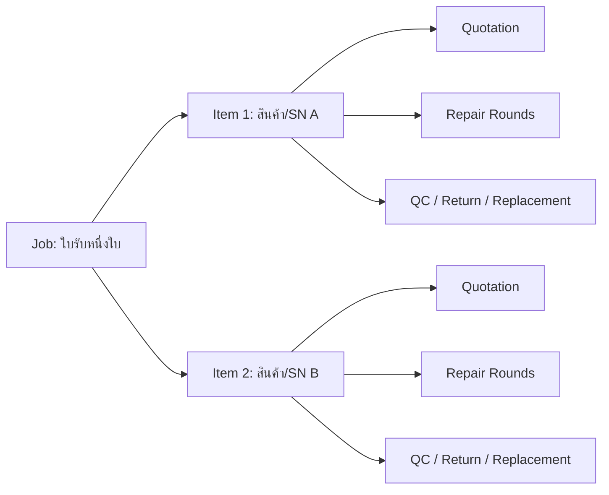
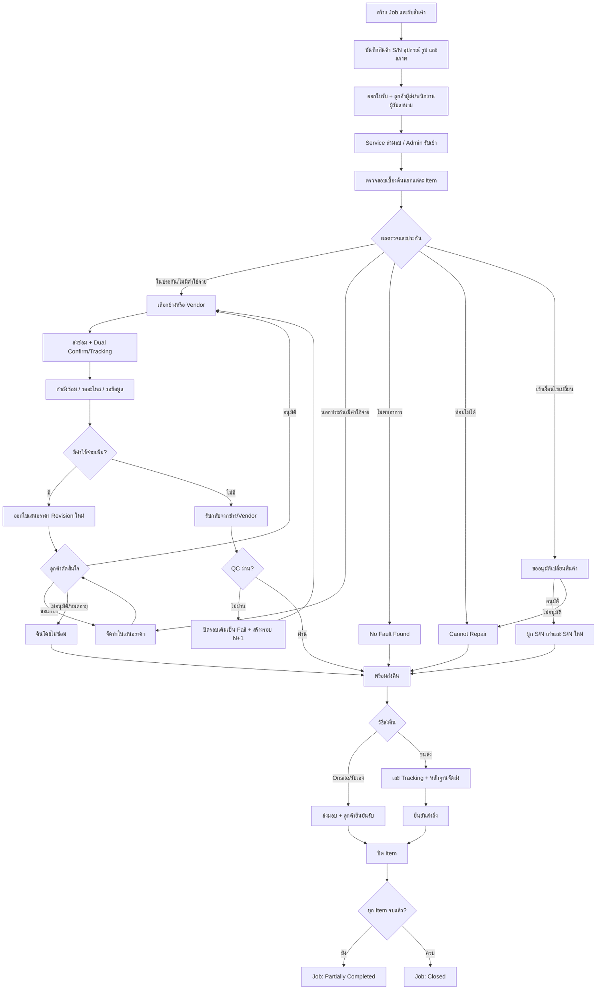

# ระบบรับ-ส่ง-ซ่อม-เปลี่ยนและคืนสินค้า — Revised Pilot Plan (No Login)

## 1. เป้าหมายและขอบเขต

สร้าง Web App สำหรับติดตามสินค้าตั้งแต่รับจากลูกค้า ตรวจสอบ ส่งซ่อม อนุมัติราคา ซ่อม/QC หลายรอบ เปลี่ยนสินค้า และส่งคืน โดยใช้ HTML/CSS/JavaScript กับ Firebase Firestore/Storage และรองรับหลายทีมใช้งานร่วมกันแบบ real-time

ฉบับนี้ใช้สำหรับ **ทดลอง Flow และ Pilot ก่อน** จึงยังไม่มี Login ตามคำขอ แต่ต้องออกแบบข้อมูลให้เพิ่ม Firebase Authentication และ Role-based Security ภายหลังได้โดยไม่เปลี่ยน business data หลัก

### ขอบเขต Pilot

- ผู้ใช้เลือกทีมและชื่อผู้ทำรายการจาก Employee Master ก่อนทำ Action
- ทุก Action เก็บ `actorId`, `actorName`, `actorTeam`, เวลา และหมายเหตุ
- แสดงแถบเตือนชัดเจนว่าเป็น Pilot และข้อมูลผู้ทำรายการยังไม่ใช่หลักฐานยืนยันตัวตน
- ไม่เปิดเผย URL ต่อสาธารณะ และใช้เฉพาะข้อมูลทดสอบ/ข้อมูลที่ยอมรับความเสี่ยงแล้ว
- ห้ามอ้าง Audit Log ระยะ Pilot เป็นหลักฐานระบุตัวบุคคล
- Authentication, Role และ Security Rules แบบ production เป็น Phase ถัดไป ไม่รวมใน Pilot นี้

## 2. หลักการสำคัญของแบบข้อมูล

หนึ่ง Job เป็นใบรับ/เคสของลูกค้าหนึ่งครั้ง และมีสินค้าได้หลายรายการ แต่สถานะการซ่อม ราคา Vendor, QC และการส่งคืนทำงานที่ระดับ **Job Item** เพราะสินค้าแต่ละชิ้นอาจดำเนินการไม่พร้อมกัน



### กติกาสถานะระดับ Job

- Job Status เป็นสถานะสรุปที่คำนวณจาก Items ไม่ใช่แหล่งข้อมูลหลักของ workflow
- `closed` เมื่อ Item ทุกชิ้นอยู่ใน terminal state และมีหลักฐานส่งมอบ/เหตุผลปิดครบ
- `partially_completed` เมื่อบาง Item ส่งมอบแล้ว แต่อีกบาง Item ยังไม่จบ
- `cancelled` ใช้ได้เมื่อทั้ง Job ถูกยกเลิกก่อนมี Item ที่ดำเนินการต่อไม่ได้แล้วเท่านั้น
- ห้ามแก้ Job Status ตรงจาก UI; ต้องเปลี่ยนผ่าน Action ของ Item

## 3. End-to-End Flow



## 4. ใบเสนอราคาและการอนุมัติก่อนซ่อม

ใบเสนอราคาต้องอยู่ **หลังการตรวจสอบเบื้องต้นและก่อนเริ่มซ่อม** เว้นแต่เป็นงานในประกันหรือผู้มีอำนาจกำหนดว่าไม่ต้องอนุมัติ

### Quotation ต้องรองรับ

- เลขที่ใบเสนอราคาและ revision
- Item ที่เกี่ยวข้อง รายการค่าแรง/อะไหล่/ค่าขนส่ง/ค่าตรวจสอบ
- ยอดก่อนภาษี ภาษี ส่วนลด และยอดสุทธิ
- วันออก วันหมดอายุ และเงื่อนไข
- สถานะ `draft`, `sent`, `approved`, `rejected`, `revision_requested`, `expired`, `superseded`
- หลักฐานอนุมัติ: ชื่อผู้อนุมัติ ช่องทาง วันที่ ไฟล์/หมายเหตุ
- เหตุผลไม่อนุมัติหรือขอแก้ไข
- กรณีค่าใช้จ่ายเพิ่มต้องสร้าง revision ใหม่ ห้ามแก้ยอดของฉบับที่อนุมัติแล้ว
- ระบุค่าตรวจสอบ/ค่าเปิดเครื่องที่เรียกเก็บแม้ลูกค้าไม่ซ่อม

## 5. Item State Machine

| Status | ความหมาย | Action ถัดไปหลัก |
|---|---|---|
| `received` | รับสินค้าแล้ว | ออกใบรับ/ส่ง Admin |
| `admin_received` | Admin รับเข้า | ตรวจสอบเบื้องต้น |
| `diagnosing` | กำลังตรวจอาการ | ระบุผลตรวจ/ประกัน/ราคา |
| `quote_pending` | รอส่งหรือรออนุมัติราคา | อนุมัติ/แก้ไข/ปฏิเสธ |
| `approved_for_repair` | อนุมัติให้ซ่อม | เลือกปลายทางซ่อม |
| `waiting_repair_handoff` | รอผู้รับยืนยัน | Confirm รับงาน |
| `repair_in_progress` | กำลังซ่อม | อัปเดตงาน/ซ่อมเสร็จ |
| `waiting_parts` | รออะไหล่ | รับอะไหล่/ยกเลิก/เปลี่ยนแนวทาง |
| `waiting_customer_info` | รอข้อมูลลูกค้า | รับข้อมูล/ยกเลิกตามกติกา |
| `repair_completed` | ซ่อมเสร็จและรับกลับ | QC |
| `qc_failed` | QC ไม่ผ่าน | สร้าง Repair Round ใหม่ |
| `ready_to_return` | พร้อมคืน | เลือกวิธีส่งคืน |
| `return_in_progress` | อยู่ระหว่างส่งคืน | ยืนยันส่งถึง |
| `delivered` | ลูกค้ารับแล้ว | ปิด Item |
| `no_fault_found` | ตรวจไม่พบอาการ | คืนสินค้า |
| `cannot_repair` | ซ่อมไม่ได้ | คืน/เปลี่ยน/จำหน่ายตามอนุมัติ |
| `replacement_pending` | รออนุมัติเปลี่ยน | อนุมัติ/ไม่อนุมัติ |
| `replaced` | เปลี่ยนสินค้าแล้ว | ส่งมอบ |
| `return_unrepaired` | ลูกค้าไม่อนุมัติซ่อม | คืนสินค้า |
| `cancelled` | ยกเลิกรายการพร้อมเหตุผล | Terminal หรือคืนสินค้า |
| `closed` | ปิด Item สมบูรณ์ | Reopen โดยเหตุผลและผู้อนุมัติ |

### Transition Guard

ทุก transition ต้องกำหนด `from`, `action`, `to`, ทีมที่ทำได้ใน Pilot, required fields, validation และผลข้างเคียง เช่น log, confirmation, notification และ SLA event ห้ามเปลี่ยนค่า `status` โดยตรง

ตัวอย่าง:

| From | Action | To | Required |
|---|---|---|---|
| `diagnosing` | ขออนุมัติราคา | `quote_pending` | diagnosis, quotationId, expiry |
| `quote_pending` | ลูกค้าอนุมัติ | `approved_for_repair` | approver, channel, approvedAt |
| `repair_completed` | QC ไม่ผ่าน | `qc_failed` | qcChecklist, reason, qcBy, evidence |
| `ready_to_return` | ส่งขนส่ง | `return_in_progress` | carrier, tracking, shippedAt |
| `delivered` | ปิดรายการ | `closed` | deliveryEvidence, deliveredAt |

## 6. Exception และ Replacement Flow

### Exception ที่ต้องรองรับ

- ไม่พบอาการ (`no_fault_found`)
- ซ่อมไม่ได้ (`cannot_repair`)
- ลูกค้าไม่อนุมัติ/ใบเสนอราคาหมดอายุ
- รอลูกค้าตอบเกินกำหนด
- รออะไหล่หรืออะไหล่เลิกผลิต
- เรียกสินค้ากลับจาก Vendor หรือเปลี่ยน Vendor
- สินค้าสูญหาย/เสียหายระหว่างส่งมอบหรือขนส่ง
- ส่งมอบผิดรายการ/เลข S/N ไม่ตรง
- ลูกค้าไม่มารับของเกินกำหนด
- ส่งคืนบางส่วน
- ปิดแล้วเปิดใหม่ โดยบันทึกเหตุผลและความเชื่อมโยงกับสถานะเดิม

### Replacement

เก็บเหตุผล, ผู้อนุมัติ, วันที่อนุมัติ, Product/S/N เดิม, Product/S/N ใหม่, การจัดการสินค้าเดิม, วันเริ่มประกันใหม่, เอกสารอ้างอิง และหลักฐานส่งมอบ ห้ามเขียนทับ S/N เดิม

## 7. Dual-confirm และการส่งมอบ

ใช้ Sender Confirm → Receiver Confirm ในจุดที่มีการเคลื่อนย้ายความรับผิดชอบ:

1. ลูกค้าส่งสินค้า → Service รับ
2. Service ส่ง → Admin รับ
3. Admin ส่ง → ช่างภายในรับ
4. Admin ส่ง Vendor → บันทึกหลักฐานส่ง; Vendor รับโดย Admin บันทึกจากหลักฐานใน Pilot
5. Vendor/ช่างส่งกลับ → Admin รับ
6. Admin ส่ง → Service/ขนส่งรับ
7. Service/ขนส่งส่งถึง → ลูกค้ารับ

สำหรับ Vendor และลูกค้าที่ไม่ได้เข้า App ให้เก็บ `confirmedByProxy`, ผู้บันทึก, แหล่งหลักฐาน และไฟล์แนบ ห้ามแสดงว่า Vendor/ลูกค้าเป็นผู้กด Confirm เอง

## 8. เอกสารและไฟล์แนบ

### เอกสารขั้นต่ำ

- ใบรับสินค้าจากลูกค้า
- ใบส่งมอบ Service → Admin
- ใบส่งซ่อม/ใบรับกลับ Vendor
- ใบเสนอราคาและ revision
- ใบตรวจ QC
- ใบส่งคืน/ใบส่งมอบลูกค้า
- เอกสารเปลี่ยนสินค้า

ใบรับต้องระบุบทบาทถูกต้อง: **ลูกค้า/ผู้แทนเป็นผู้ส่งมอบสินค้า และ Service เป็นผู้รับสินค้า** ส่วนใบส่งคืนจึงสลับเป็น Service ผู้ส่งมอบและลูกค้าเป็นผู้รับ

### Attachment Schema

```text
jobs/{jobId}/attachments/{attachmentId}
  itemId, repairRoundId, quotationId
  type: intake_photo | warranty | quotation | approval | qc_photo | shipping | signature | other
  storagePath, originalName, mimeType, sizeBytes
  description, uploadedByActor, uploadedAt
  isDeleted, deletedAt, deletedByActor
```

กำหนดชนิด/ขนาดไฟล์ที่อนุญาต, ตรวจชื่อไฟล์, แสดง preview, retry upload และห้ามลบไฟล์ที่ใช้อ้างอิงเอกสารที่ปิดแล้วโดยไม่มี override reason

## 9. Firestore Data Model

```text
jobs/{jobId}
  jobNo, customerSnapshot, receiveMethod
  summaryStatus, itemCounts, tags
  createdByActor, createdAt, updatedAt
  isDeleted, deletedAt, deletedByActor, deleteReason

jobs/{jobId}/items/{itemId}
  productSnapshot, serialNo, symptom, accessories, intakeCondition
  warrantyStatus, warrantyExpiry, warrantyEvidenceIds
  status, currentRepairRound, currentVendorId
  slaPolicyId, slaDueAt, slaPausedAt, slaPausedSeconds
  replacementId, deliveredAt, closedAt
  version, createdAt, updatedAt

jobs/{jobId}/items/{itemId}/repairRounds/{roundId}
  roundNumber, repairType, vendorSnapshot, technicianActor
  sentAt, acceptedAt, receivedBackAt
  diagnosis, workPerformed, partsUsed, cost
  trackingOut, trackingIn
  qcResult, qcChecklist, qcNote, qcActor, qcAt
  result, notes

jobs/{jobId}/quotations/{quotationId}
  quotationNo, revision, itemIds, lines
  subtotal, discount, tax, total, currency
  issuedAt, expiresAt, status, supersedesId
  approvalName, approvalChannel, approvalEvidenceId, decisionAt, decisionReason

jobs/{jobId}/confirmations/{confirmationId}
  itemIds, handoffType, repairRoundId
  senderActor, senderConfirmedAt, senderNote
  receiverActor, receiverConfirmedAt, receiverNote
  confirmedByProxy, proxyEvidenceId, isComplete

jobs/{jobId}/attachments/{attachmentId}
jobs/{jobId}/logs/{logId}
  entityType, entityId, action, fromStatus, toStatus
  actorId, actorName, actorTeam, note
  requestId, createdAt, metadata

replacements/{replacementId}
  jobId, itemId, reason, approval
  oldProductSnapshot, oldSerialNo
  newProductSnapshot, newSerialNo
  oldItemDisposition, newWarrantyStart, evidenceIds

customers/{customerId}
products/{productId}
vendors/{vendorId}
employees/{employeeId}
serialIndex/{serialKey}
counters/{counterId}
slaPolicies/{policyId}
```

ใช้ Snapshot ของลูกค้า/สินค้า/Vendor ในเอกสารธุรกรรม เพื่อให้เอกสารเก่าไม่เปลี่ยนเมื่อแก้ Master Data

## 10. ความสอดคล้องและ Concurrency

- สร้างเลข Job/Quotation ด้วย Firestore transaction หรือ document ID ที่ไม่ซ้ำ
- ทุก Action มี `requestId` เพื่อป้องกันการกดซ้ำ/retry แล้วสร้างข้อมูลซ้ำ
- Item มี `version`; transaction ต้องตรวจ version และสถานะต้นทางก่อนเปลี่ยน
- ใช้ Firestore server timestamp เป็นเวลาหลักและแสดงผล timezone Asia/Bangkok
- การสร้าง Repair Round, เปลี่ยนสถานะ, Log และ Confirmation ที่เกี่ยวข้องต้องสำเร็จแบบ atomic เท่าที่ Firestore รองรับ
- สถิติ Vendor และ serial history ต้องสร้างซ้ำได้จากข้อมูลธุรกรรม ไม่ถือ counter เป็น source of truth
- มี UI แจ้ง conflict และ reload ข้อมูลล่าสุด แทนการเขียนทับเงียบ ๆ

## 11. SLA และการแจ้งเตือนใน App

กำหนด SLA ตามประเภทงาน/ประกัน/Vendor โดยมีเวลาเริ่ม, due date, warning threshold และ pause reasons เช่นรอลูกค้า/รออนุมัติ งานรออะไหล่จะ pause หรือไม่ต้องกำหนดเป็น business rule

Dashboard แสดง:

- ใกล้เกิน SLA / เกิน SLA
- รอ Confirm
- รอลูกค้าอนุมัติ
- รออะไหล่
- รอ QC
- ของอยู่ Vendor นานผิดปกติ
- ลูกค้าไม่มารับของ
- งานที่มีการเปลี่ยนสถานะหลัง visit ล่าสุดของ browser/device

ระยะ No-login ใช้ in-app badge เท่านั้น และ `lastSeenAt` เป็นระดับ browser/device ไม่ใช่ผู้ใช้ที่ยืนยันตัวตน

## 12. Search, Dashboard และ Analytics

- ค้นหา Job No, ลูกค้า, โทรศัพท์, S/N, Tracking, Quotation No และ Tag
- Filter ตาม Item Status, Job Summary, ทีม, Vendor, ประกัน, SLA และวันที่
- รองรับ Job หลาย Item และแสดง progress ราย Item
- Vendor turnaround ใช้ `acceptedAt → receivedBackAt` พร้อมนิยาม business/calendar days ให้ชัด
- QC first-pass rate, rework rate, cannot-repair rate, overdue rate และงานค้าง
- ประวัติ S/N ต้องรวม Repair Round และ Replacement โดยไม่เก็บ array ที่โตไม่จำกัดใน document เดียว
- Export Excel ต้องระบุช่วงเวลาและเวลา export

## 13. การลบและ Audit

ใช้ Soft Delete เป็นค่าเริ่มต้น ห้ามลบ Job จริงจาก UI ทั่วไป การลบต้องเก็บเหตุผล ผู้ทำ และเวลา พร้อมซ่อนจากหน้าปกติแต่ยังค้นคืนได้ในหน้าผู้ดูแล Pilot

Hard Delete เป็น maintenance procedure แยกต่างหาก ต้องตรวจและลบ subcollections, Storage files, serial index และเอกสารอ้างอิงอย่างครบถ้วน ไม่รวมใน UI ระยะ Pilot

Audit Log เป็น append-only ในระดับ application แต่เนื่องจากไม่มี Login จึงใช้เพื่อตรวจลำดับเหตุการณ์เท่านั้น ไม่รับรองตัวบุคคล

## 14. Security สำหรับ Pilot แบบไม่มี Login

> ข้อยกเว้นชั่วคราวนี้มีไว้ทดสอบ Flow เท่านั้น ไม่ใช่ Production Security

- แยก Firebase Project ของ Pilot ออกจาก Production
- ใช้ App Check และจำกัด allowed domains เท่าที่ทำได้
- ไม่ใช้ข้อมูลส่วนบุคคลจริงเกินจำเป็น และไม่เก็บเอกสารสำคัญใน Pilot
- แสดง environment banner และวันสิ้นสุด Pilot
- สำรองข้อมูลก่อนเปลี่ยน schema
- Security Rules ต้องระบุวันทบทวนและ owner
- หากจำเป็นต้องใช้ `allow read, write: if true` ให้ใช้เฉพาะ project ทดสอบ, ไม่เผยแพร่ config/URL สาธารณะ และถือว่าทุกข้อมูลใน project อ่าน/แก้/ลบได้โดยผู้เข้าถึง
- ก่อนใช้งานจริงต้องเพิ่ม Firebase Authentication, Role-based rules และทดสอบ rule emulator

### โครงสร้าง actor เพื่อย้ายไป Login ภายหลัง

```text
actorId          // Pilot: employeeId, Production: auth.uid
actorName
actorTeam
actorSource      // selected_employee | authenticated_user
```

## 15. Backup, Restore และ Data Retention

- กำหนด export Firestore/Storage ก่อน Pilot และตามรอบ
- มีขั้นตอน restore ที่ทดลองจริงอย่างน้อยหนึ่งครั้ง
- กำหนดระยะเก็บรูป, ใบเสนอราคา, ลายเซ็น และงานที่ปิดแล้ว
- Export งานหนึ่ง Job ต้องรวม Items, Rounds, Quotations, Confirmations, Logs และรายการไฟล์แนบ
- ห้ามถือ Excel export เป็น backup เดียวของระบบ

## 16. หน้าจอหลัก

1. Dashboard — สถานะรวม, SLA, งานรอ action และ progress ราย Item
2. Create Job — ลูกค้า, วิธีรับ, หลาย Item, S/N, อาการ, อุปกรณ์, รูปสภาพ
3. Job Detail — tabs Overview, Items, Quotations, Handoffs, Attachments, Timeline
4. Item Detail — state action, diagnosis, quotation, repair rounds, QC, replacement และ return
5. Master Data — Customer, Product, Vendor, Employee, SLA policy
6. Documents — preview/print/download เอกสารทุกประเภท
7. Analytics — Vendor, SLA, QC, rework และ S/N history
8. Pilot Admin — soft-deleted records, export/backup status และ environment information

## 17. Validation สำคัญ

- S/N ต้อง normalize ก่อนค้นและสร้าง serial key; รองรับสินค้าไม่มี S/N ด้วย asset identifier ภายใน
- ห้าม Item เดียวมี active Job ซ้ำโดยไม่เตือนและบันทึก override reason
- QC ผู้ตรวจต้องไม่ว่าง และต้องกรอก checklist ตามประเภทสินค้า
- ห้ามเริ่มซ่อมงานมีค่าใช้จ่ายหากไม่มี quotation ที่อนุมัติและยังมีผล
- ห้ามปิด Item หากไม่มี delivery evidence หรือ terminal exception พร้อมเหตุผล
- ห้ามปิด Job จนทุก Item จบ
- การแก้ Master Data ไม่แก้ Snapshot ในเอกสารเก่า
- วันที่ส่ง/รับ/QC/ส่งมอบห้ามขัดลำดับเวลา เว้นแต่มี override reason

## 18. Test Plan และ Acceptance Criteria

### Flow Tests

- ในประกัน → ซ่อม → QC ผ่าน → ส่งคืน → ปิด
- นอกประกัน → ใบเสนอราคาอนุมัติ → ซ่อม
- ใบเสนอราคาถูกปฏิเสธ/ขอแก้/หมดอายุ
- มีค่าใช้จ่ายเพิ่มหลังเริ่มซ่อมและต้องอนุมัติ revision
- QC ไม่ผ่านสองรอบ และเปลี่ยน Vendor ระหว่างรอบ
- ไม่พบอาการ, ซ่อมไม่ได้, ลูกค้าไม่มารับ
- Replacement พร้อม S/N เดิม/ใหม่
- Job หลาย Item: คนละ Vendor, คนละสถานะ, ส่งคืนบางส่วน
- สูญหาย/เสียหายระหว่างขนส่งและ reopen หลังปิด

### Technical Tests

- สอง browser กด Action เดียวกันพร้อมกัน ต้องเกิด transition เดียว
- retry หลัง network fail ต้องไม่สร้าง Repair Round/Log ซ้ำ
- Upload fail/retry และไฟล์เกินขนาด
- Job No และ Quotation No ไม่ซ้ำ
- Search S/N/Tracking/ลูกค้าและ filter SLA ถูกต้อง
- Timezone และการคำนวณ SLA ถูกต้อง
- Soft delete/restore ไม่ทำลายประวัติ
- Export/backup/restore อ่านข้อมูลได้ครบ
- Responsive บนมือถือและ print layout ทุกเอกสาร

### Definition of Done สำหรับ Pilot

- ทุก transition ผ่าน state machine และมี validation
- ทุก Action มี Log และ actor snapshot
- ไม่มีการแก้ status ตรงหรือ hard delete จาก UI ปกติ
- Flow tests ข้างต้นผ่านทั้งหมด
- ผู้ทดสอบสามารถติดตามตำแหน่งและผู้รับผิดชอบของแต่ละ Item ได้
- เอกสารพิมพ์แสดงข้อมูลและบทบาทผู้ส่ง/ผู้รับถูกต้อง
- มีรายการ Known Limitations เรื่อง No-login แสดงใน README และหน้า App

## 19. Implementation Phases

### Phase 0 — Business Rules

ยืนยัน Item-level workflow, quotation timing, SLA calendar, QC checklist, replacement approval, partial return และเงื่อนไขปิดงาน แล้วสร้าง Transition Matrix ฉบับ executable

### Phase 1 — Pilot Foundation

สร้าง Firebase Pilot project, Firestore/Storage, App Check, environment config, README, master data และ actor selector โดยไม่ทำ Login

### Phase 2 — Data Model + Workflow Engine

สร้าง Job/Items, transaction actions, idempotency, logs, soft delete และ state guards พร้อม automated transition tests

### Phase 3 — Intake + Documents

สร้างรับสินค้า รูป/ไฟล์แนบ ใบรับ QR ลายเซ็น/ชื่อผู้ส่งและผู้รับ และ handoff Service → Admin

### Phase 4 — Diagnosis + Quotation + Repair

สร้างการวินิจฉัย ประกัน quotation/revision/approval, Vendor handoff, tracking, repair round และ waiting states

### Phase 5 — QC + Exceptions + Replacement + Return

สร้าง QC/rework, cannot repair, no fault found, replacement, partial return, delivery evidence, close/reopen

### Phase 6 — Dashboard + Analytics

สร้าง search/filter, SLA widgets, Service view, Vendor analytics, serial/replacement history และ Excel export

### Phase 7 — Pilot Verification

ทดสอบทุก branch, concurrency, retry, print, backup/restore และแก้ defect ก่อนทดลองกับกลุ่มเล็ก

### Phase 8 — Production Hardening (ภายหลัง Pilot)

เพิ่ม Firebase Authentication, Role-based authorization, production Security Rules, verified actor identity, monitoring, retention และ migration จาก Pilot; Phase นี้ตั้งใจเลื่อนไว้ตามคำขอ ไม่ตัดออกจาก roadmap

## 20. สิ่งที่ต้องเตรียม

1. รายชื่อทีมและพนักงานสำหรับ dropdown ระยะ Pilot
2. ประเภทสินค้าและ QC checklist
3. กติกาประกัน ใบเสนอราคา ภาษี และผู้อนุมัติ Replacement
4. SLA ตามประเภทงานและ Vendor
5. รูปแบบเลขเอกสาร Logo และข้อความเงื่อนไข
6. รายชื่อ Vendor/ขนส่งและหลักฐานที่ใช้ยืนยันรับส่ง
7. วันเริ่ม–สิ้นสุด Pilot, ผู้รับผิดชอบ Firebase และขั้นตอนสำรองข้อมูล

## 21. Known Limitations ของฉบับนี้

- ไม่มี Login และไม่สามารถพิสูจน์ว่าผู้เลือกชื่อเป็นบุคคลนั้นจริง
- ไม่มีสิทธิ์ระดับผู้ใช้ที่เชื่อถือได้
- Vendor/ลูกค้าไม่ได้เข้าระบบและใช้ proxy confirmation จากหลักฐาน
- In-app notification ผูกกับ browser/device ไม่ใช่บัญชีบุคคล
- ห้ามใช้กับข้อมูลสำคัญหรือเปิดเป็น Production จนกว่า Phase 8 จะเสร็จ

